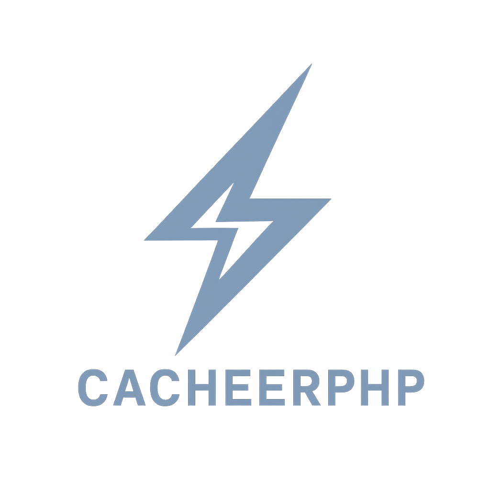

# CacheerPHP

<p align="center">
  <a href="https://github.com/silviooosilva/CacheerPHP"></a>
</p>

<p align="center">
  <strong>An explicit, instance-first PHP cache with a tiny core, optional capabilities, and zero framework lock-in.</strong>
</p>

<p align="center">
  <a href="https://github.com/silviooosilva/CacheerPHP/releases"></a>
  
  
  <a href="https://github.com/silviooosilva/CacheerPHP"></a>
</p>

---

> **CacheerPHP 6.x** is an instance-first rewrite. The engine is a small `Cache`
> kernel over a minimal `Store` contract; everything else — batching, tags,
> locks, atomic counters, tiering, resilience, encryption — is an **optional
> capability** you opt into. There is no global state and no autoload-time side
> effect. Upgrading from v5? Jump to [Migrating from v5](#migrating-from-v5).

## Five-minute quick start

```sh
composer require silviooosilva/cacheer-php
```

The core installs with **no backend clients and no required extensions** —
`ArrayStore` and `FileStore` work out of the box.

```php
use Silviooosilva\CacheerPhp\Kernel\Cache;

// Dependency-free, in-process. Great for tests and short CLI runs.
$cache = Cache::inMemory();

// Write with a TTL (seconds, "10 minutes", a DateInterval, or null = forever).
$cache->set('user:42', ['name' => 'Ada'], ttl: '10 minutes');

// Read (returns your default on a miss).
$user = $cache->get('user:42', default: null);

// Compute-once: on a miss, run the callback, store it, return it.
$report = $cache->remember('report:daily', ttl: 3600, callback: function () {
    return expensive_report();
});

// Existence and deletion.
$cache->has('user:42');     // true
$cache->delete('user:42');
```

Swap the store, keep the API:

```php
$cache = Cache::file('/var/cache/app');      // persistent, dependency-free
$cache = Cache::database($pdo, 'cacheer');   // inject your own PDO
$cache = Cache::redis($connection);          // predis or phpredis adapter
```

## Why v6

- **Tiny core, honest capabilities.** A store implements four methods; extra
  behavior is declared by interface and checked at runtime — a backend never
  pretends to guarantee something it can't. See [CAPABILITIES.md](CAPABILITIES.md).
- **Instance-first, no globals.** Construct exactly the cache you need; run
  several side by side; nothing reads the environment or the clock behind your
  back.
- **Scopes instead of stringly namespaces.** `->scope('billing')` is an isolated
  keyspace you can clear on its own.
- **Composable decorators.** Tiered (L1/L2), resilient (circuit-breaker
  fallback), and instrumented (typed events + metrics) all wrap any store.
- **Stampede protection built in.** `remember()` single-flights across workers;
  `flexible()` is stale-while-revalidate with a deferred refresh.
- **Authenticated storage.** Values are serialized → optionally compressed →
  optionally AES-256-GCM encrypted into a versioned, tamper-evident envelope.
- **Standards-first.** PSR-16 and PSR-6 adapters, a PSR-3 logging subscriber, and
  a PSR-14 event bridge ship in the box.
- **Deterministic tests.** Time is an injected `Clock`; the suite uses a
  `FakeClock` and needs no `sleep()`.

## Core recipes

### Scopes

```php
$cache->scope('reports')->set('daily', $rows);
$cache->scope('billing')->set('daily', $invoice);   // independent entry
$cache->scope('reports')->clear();                  // clears only that scope
```

### Stampede protection & stale-while-revalidate

```php
// One worker computes on a miss; the rest wait and read the result.
$value = $cache->remember('key', 3600, fn () => build());

// Serve fresh for 30s, then serve stale while a single worker refreshes,
// recomputing synchronously after 300s.
$value = $cache->flexible('feed', fresh: 30, stale: 300, callback: fn () => build());
```

### Tiering, resilience, observability

```php
use Silviooosilva\CacheerPhp\Observability\{EventBus, MetricsCollector};

$cache = Cache::tiered($l1, $l2);                 // fast local in front of shared
$cache = Cache::resilient($primary, $fallback);   // fall back when the breaker trips

$events = new EventBus();
$metrics = new MetricsCollector();
$events->listen($metrics->record(...));
$cache = Cache::instrumented($store, $events);    // typed events; values never captured
$metrics->snapshot();                             // hit_rate, latency, bytes, ...
```

### Encryption & compression

```php
use Silviooosilva\CacheerPhp\Config\PipelineConfig;
use Silviooosilva\CacheerPhp\Storage\Encryption\Keyring;

$pipeline = PipelineConfig::default()
    ->withGzip()
    ->withKeyring(Keyring::fromPassphrases(['current' => $secret], 'current')); // AES-256-GCM

$cache = Cache::file('/var/cache/app', $pipeline);
```

### Atomic counters, tags, locks (capabilities)

Capabilities live on the store. Use them via the store, or through the
[`LegacyCacheer`](src/Compat/LegacyCacheer.php) bridge:

```php
$store->increment(Key::named('visits'));          // AtomicStore
$store->tag(Key::named('p1'), 'products');         // TaggableStore
$lock = $store->lock('import', Ttl::seconds(30));  // LockingStore
```

## PSR adapters

```php
use Silviooosilva\CacheerPhp\Psr\{Psr16Cache, Psr6Pool};

$psr16 = new Psr16Cache($cache);                   // Psr\SimpleCache\CacheInterface
$pool  = new Psr6Pool($cache, $clock);             // Psr\Cache\CacheItemPoolInterface
```

## Operations CLI

```sh
vendor/bin/cacheer doctor        # environment health check
vendor/bin/cacheer stats         # store + capabilities + entry count
vendor/bin/cacheer inspect <key> # metadata only, never the value
vendor/bin/cacheer prune --dry-run
vendor/bin/cacheer clear --force
vendor/bin/cacheer migrate --dry-run   # print schema DDL without executing
```

Point the CLI at a `cacheer.config.php` that returns a `Store` (or
`['store' => ..., 'pdo' => ..., 'table' => ...]`).

## Migrating from v5

The [`LegacyCacheer`](src/Compat/LegacyCacheer.php) bridge exposes the v5 method
surface on top of the v6 engine, so you can upgrade without rewriting every call
site at once:

```php
use Silviooosilva\CacheerPhp\Compat\LegacyCacheer;

$cache = LegacyCacheer::file('/var/cache');        // or ::inMemory()
$cache->putCache('user:1', $user, 'accounts', 3600);
$user = $cache->getCache('user:1', 'accounts');
```

- Turn on `emitDeprecations: true` in development to find call sites to migrate
  (silent by default).
- Run the optional [`rector.php`](rector.php) set for the straightforward renames.
- `FileStore`/`DatabaseStore` can **rewrite v5 payloads into the v6 envelope on
  read** during the migration window.

The full guide, method-by-method mapping, and database migration/rollback steps
are in **[MIGRATION.md](MIGRATION.md)**.

## Building a custom store

Implement four methods, add capability interfaces you can honor, and prove it
with the shared conformance suite — no need to read the built-in store source.
See **[WRITING_A_STORE.md](WRITING_A_STORE.md)**.

## Requirements

- **PHP 8.3+**
- `ext-openssl` — only for AES-256-GCM encryption
- `ext-zlib` — only for gzip compression
- `ext-pdo` — only for the database store
- `predis/predis` or `ext-redis` — only for the Redis store

The core installs and runs (Array/File stores) with none of the optional pieces.

## Testing

```sh
composer install
composer test            # service-free unit suite
composer test:kernel     # v6 kernel
composer test:contract   # store conformance
composer analyse         # PHPStan level 5
composer lint            # php-cs-fixer (dry-run)
```

Redis/MySQL/PostgreSQL integration suites run in CI; locally they skip cleanly
when the service is absent.

## Documentation

- [MIGRATION.md](MIGRATION.md) — v5 → v6 upgrade guide
- [CAPABILITIES.md](CAPABILITIES.md) — capability matrix, guarantees, failure modes
- [WRITING_A_STORE.md](WRITING_A_STORE.md) — third-party store author guide
- [SECURITY.md](SECURITY.md) — support windows and vulnerability reporting
- [KNOWN_LIMITATIONS.md](KNOWN_LIMITATIONS.md) — documented edges
- Runnable, CI-tested examples in [`examples/v6`](examples/v6)
- Full docs site: [cacheerphp.com/docs](https://cacheerphp.com/docs/en/getting-started/)
- The v6 execution plan lives in [ROADMAP.md](ROADMAP.md)

## Contributing

Contributions are welcome — see [CONTRIBUTING.md](CONTRIBUTING.md) and the issue
and pull-request templates. Substantial changes start with an RFC.

## License

CacheerPHP is open-sourced software licensed under the [MIT license](https://opensource.org/licenses/MIT).

## Support

If CacheerPHP saves you time, consider supporting the project:

<p>
  <a href="https://buymeacoffee.com/silviooosilva">
    
  </a>
</p>
